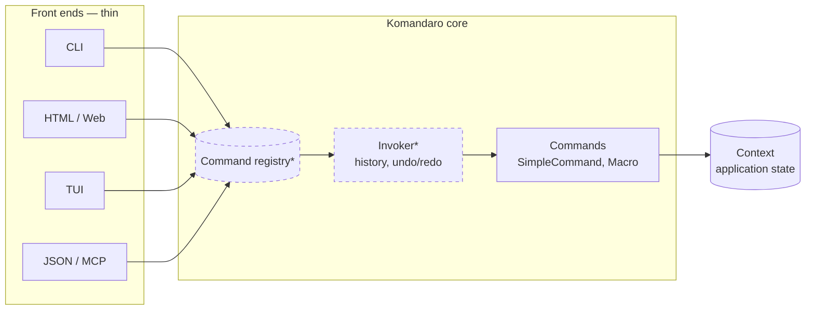
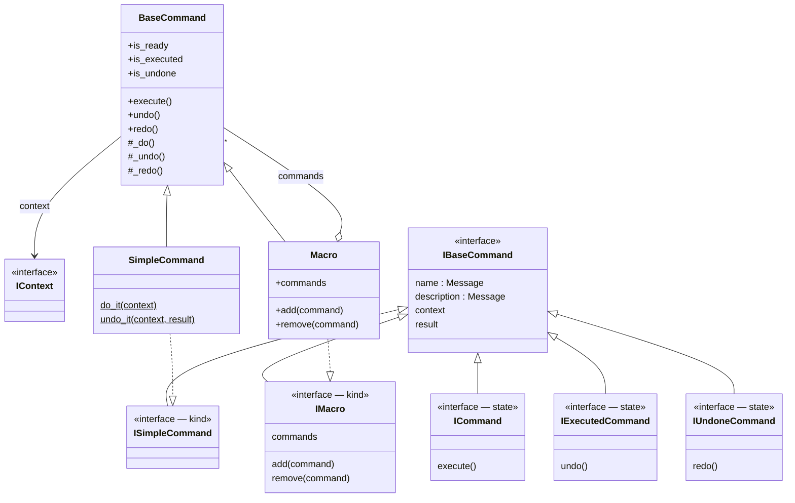
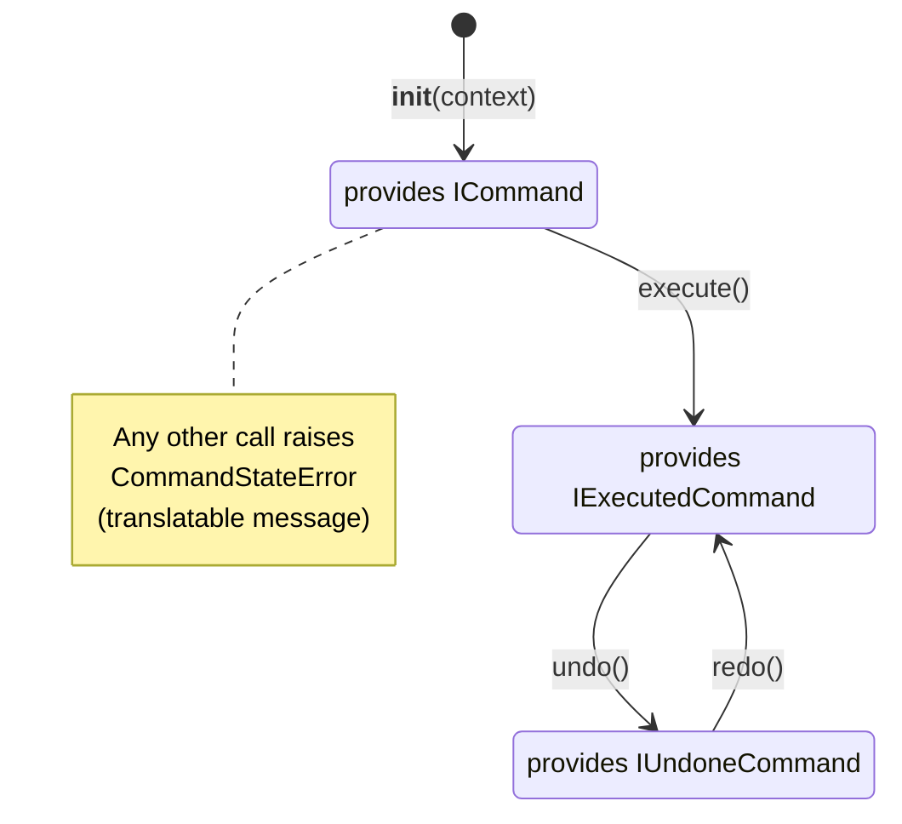
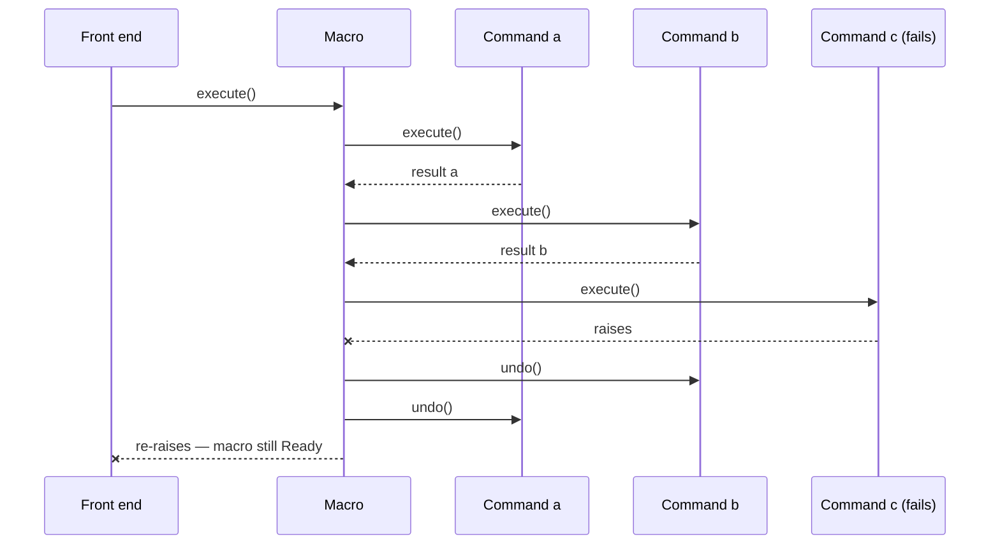
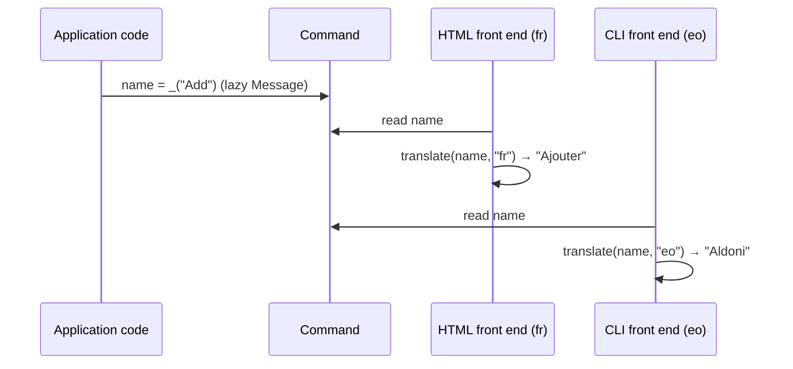

# Komandaro — Architecture

*Version française : [`docs/fr/architecture.md`](../fr/architecture.md)*

## 1. Purpose

Komandaro exists to answer one question: **how do you write an application
once and offer it through a command line, an HTML interface, a terminal UI
or an API, without duplicating its logic?**

The answer is the *Command* design pattern (Gamma et al., 1994). Every user
action is an object that:

* knows its **name** and **description** (translatable),
* is bound to an **execution context** (the application state),
* can be **executed once**, **undone** and **redone**,
* can be **composed** into atomic macros.

A front end — CLI, HTML, TUI, JSON, an AI agent — is then nothing more than
a way to *choose* a command, *bind* it to a context, *execute* it and
*render* its result. The logic lives in the commands and nowhere else.



Boxes marked `*` are planned (see §6); phase 1 delivers the `Commands`
box and its foundations.

## 2. Package layout

```
src/komandaro/
├── __init__.py      public API and __version__
├── interfaces.py    zope.interface contracts (kinds and states)
├── command.py       BaseCommand, SimpleCommand(Factory), Macro, CommandStateError
├── i18n.py          Message, make_gettext, translate
└── locale/          komandaro.pot + <lang>/LC_MESSAGES/komandaro.po
tests/               pytest suite (README doctests are run too)
docs/en, docs/fr     this document
.github/workflows/   CI: ruff, mypy, i18n check, pytest 3.12/3.13, build
```

## 3. Interfaces: kinds and states

Two orthogonal families of `zope.interface` interfaces describe a command.

**Kinds** say what a command *is*. They are declared once on the class with
`@implementer` and never change:

| Kind | Meaning |
|---|---|
| `ISimpleCommand` | a *do* function and its inverse *undo* function |
| `IMacro` | a composite of sub-commands |

**States** say where a command *is* in its life cycle. They are provided
*directly* on the instance and swapped at each transition with
`directlyProvides`:

| State | Meaning | Allowed call |
|---|---|---|
| `ICommand` | ready | `execute()` |
| `IExecutedCommand` | executed, reversible | `undo()` |
| `IUndoneCommand` | undone, replayable | `redo()` |



Why separate kinds and states? `zope.interface` refuses to remove an
interface declared by the class (`noLongerProvides` raises `ValueError`).
The 2014 prototype tried exactly that. By keeping kinds on the class and
states on the instance, `directlyProvides(self, <state>)` replaces the
whole set of *directly provided* interfaces without touching the kind, so
`ISimpleCommand.providedBy(cmd)` stays true for the object's whole life
while `ICommand.providedBy(cmd)` reflects its current state.

## 4. Life cycle



A command instance runs **exactly once**. To repeat an operation, create a
new instance: `Add(context).execute()`. This makes each instance a
faithful record of one action — the material a history/invoker will work
on (§6).

`BaseCommand` implements the state machine once; subclasses only provide
`_do()`, `_undo()` and optionally `_redo()` (defaults to `_do()`).

### SimpleCommand and SimpleCommandFactory

`SimpleCommandFactory(do, undo, name, description)` builds a *class* whose
`do_it` and `undo_it` are **static methods** — the 2014 prototype stored
plain functions as class attributes, which Python turned into bound
methods, breaking the call. The class is what a registry will expose;
instances are per execution.

`undo(context, result)` receives the value returned by `do(context)`.
For simple operations that is enough; operations that need a snapshot of
the state taken *before* execution will get a memento hook in phase 2.

### Macro

A `Macro` holds child *instances* (usually bound to the same context). It
executes them in order and undoes them in reverse order. It is
**atomic**: if a child raises during `execute()` or `redo()`, the children
already run are undone in reverse order and the exception propagates; the
macro itself stays in its previous state.



Macros nest: a macro is a `BaseCommand` like any other.

## 5. Internationalisation

Komandaro is meant to serve several users with different languages from
one process (a web server), so it **never keeps a global "current
language"**. Instead:

* `Message` is a `str` subclass carrying a gettext *domain*. `_("Add")`
  creates one. It prints, compares and hashes as the message id, so it can
  be used anywhere a string is expected.
* `translate(message, language, localedir=None)` looks the message up in
  the catalogue of its domain, for the given language (or preference list),
  and falls back to the message id if nothing is found. Front ends call it
  at *render* time with the locale of *their* user.
* `Message.localize(language, **params)` translates then `%`-formats.
* `CommandStateError` carries a `Message` and parameters; `str(error)` is
  the untranslated text, `error.translate(language)` the localised one.



**Domains.** The library's own messages are in domain `komandaro`
(catalogues `en`, `fr`, `eo`, compiled into `komandaro/locale`). An
application creates its own marker with `_ = make_gettext("myapp")` and
ships its own catalogues; `translate()` picks the right catalogue from the
message's domain. Pass `localedir` when catalogues live outside the
package.

**Workflow.** `babel.cfg` configures extraction. `.po` files are versioned,
`.mo` files are built (`pybabel compile`) and git-ignored. The CI checks
that `komandaro.pot` matches the sources and that every catalogue compiles.

## 6. Roadmap

Phase 1 (0.1) delivers a sound, tested core. The following phases build
the "one logic, many interfaces" promise on top of it.

```mermaid
gantt
    title Komandaro roadmap
    dateFormat  YYYY-MM
    axisFormat  %Y-%m
    section Phase 1 — core
    State machine, macros, i18n, tests, CI     :done, p1, 2026-09, 4w
    section Phase 2 — describe commands
    Parameter schema (zope.schema / dataclass) :p2a, after p1, 8w
    Memento hook (snapshot before execute)     :p2b, after p1, 4w
    Invoker: history, undo/redo stack, events  :p2c, after p2a, 4w
    Command registry (entry points / groups)   :p2d, after p2c, 4w
    section Phase 3 — front ends
    CLI generated from schema (argparse/Typer) :p3a, after p2d, 8w
    HTML forms + Pyramid views                 :p3b, after p2d, 12w
    TUI (Textual)                              :p3c, after p3a, 4w
    JSON API and MCP server for AI agents      :p3d, after p3b, 8w
    section Phase 4 — operations
    Async commands, persistence, audit log     :p4, after p3d, 12w
```

### Phase 2 — describing commands

* **Parameter schema.** Each command class declares the parameters it
  reads from the context: type, translatable label, default, constraints.
  This is the keystone of portability: a CLI derives options and `--help`
  from it, an HTML front end derives a form, an API derives a JSON schema.
  `zope.schema` is the natural choice in this ecosystem; a dataclass-based
  alternative will be evaluated.
* **Memento.** An optional `snapshot(context)` hook run before `_do()`,
  whose value is handed to `_undo()`, for operations whose inverse cannot
  be derived from the result alone.
* **Invoker.** Owns the undo/redo stacks, executes commands, emits events
  (executed, undone, redone) that front ends and audit logs subscribe to.
* **Registry.** Discovers command classes (entry points or explicit
  registration), organises them in groups, attaches permissions.

### Phase 3 — front ends

Each front end is a small adapter from the registry + schema to a UI
technology: `argparse`/Typer for the CLI, form rendering plus Pyramid
views for HTML, Textual for the TUI, and a JSON API that doubles as an
**MCP server** so that the same commands become tools for AI agents.

### Phase 4 — operations

Asynchronous commands (`async def _do`), persistence of the history
(ZODB or JSON), audit logging and replay.

## 7. Design decisions

| Decision | Rationale |
|---|---|
| Keep `zope.interface` | Verifiable contracts (`verifyObject`), adapters for free, natural bridge to `zope.schema` and Pyramid; the author's ecosystem. `zope.component` is *not* required. |
| States as marker interfaces, not an enum | Front ends can query `IExecutedCommand.providedBy(cmd)` and register adapters/views per state. An `is_*` property triad is provided for convenience. |
| One instance per execution | Each instance is an immutable record of one action, which is what an undo history needs. |
| Lazy messages, no global language | One process may serve many users; the locale belongs to the front end, not to the core. |
| Python ≥ 3.12, `src/` layout, hatchling | Modern packaging, no namespace package, tests run against the installed package. |
| AGPL-3.0-or-later | Copyleft that also covers network use, consistent with the author's other projects. |

## 8. History

Komandaro descends from `ecreall.command` (2014), a prototype written for
the Plone/Zope ecosystem at Ecréall. The prototype defined the interfaces
and a factory but never ran: it contained a `NameError` in the class body,
bound its do/undo functions as methods, returned an undefined variable and
tried to remove a class-level interface. Phase 1 corrected all of this,
ported the code to Python 3.12 and `@implementer`, separated kinds from
states, implemented the macro, added gettext, tests and CI.
