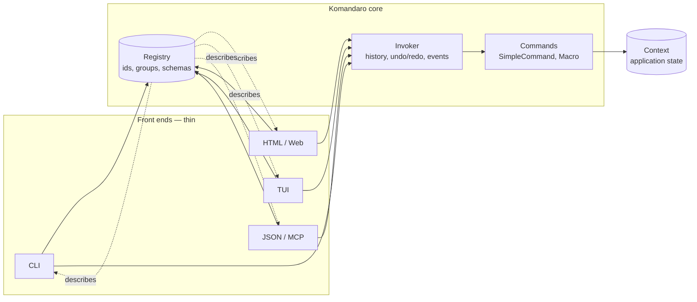
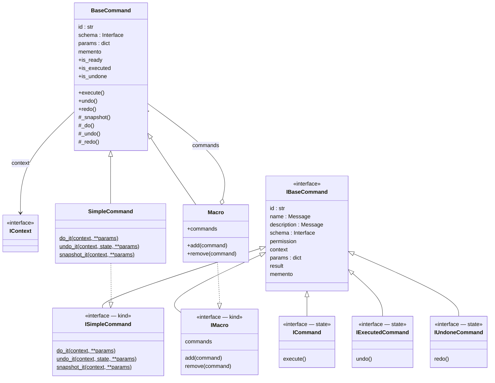
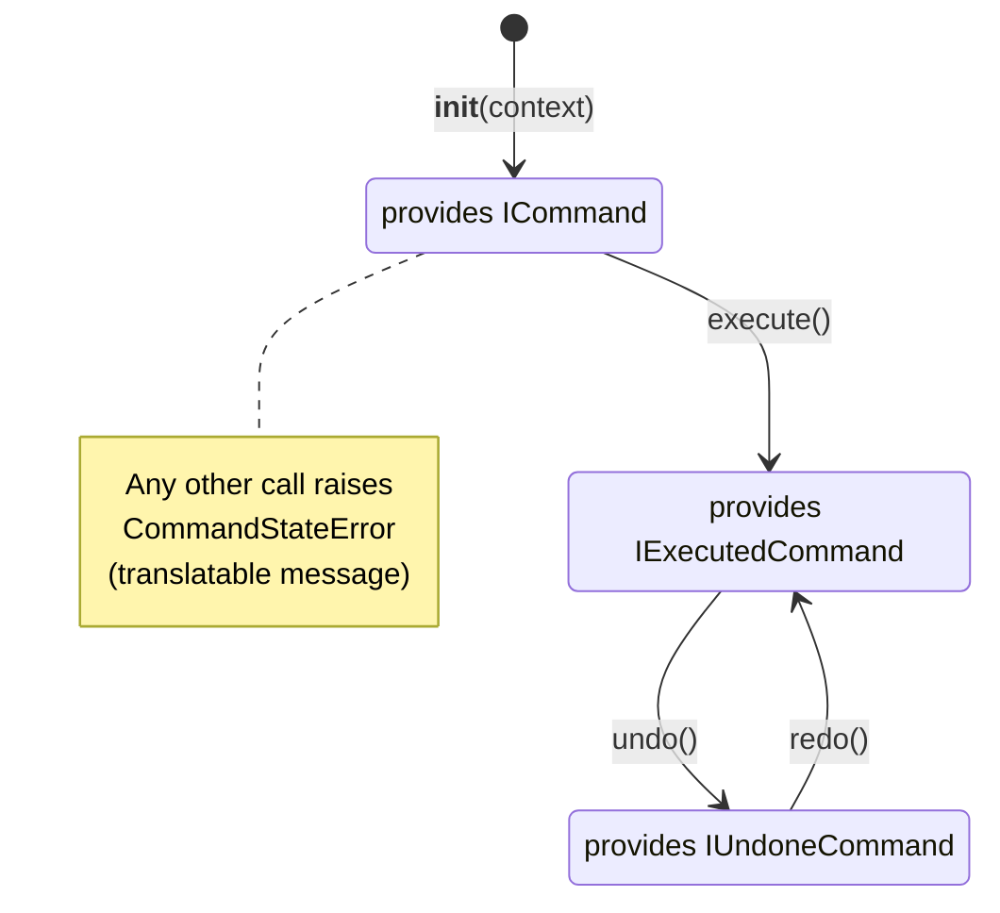
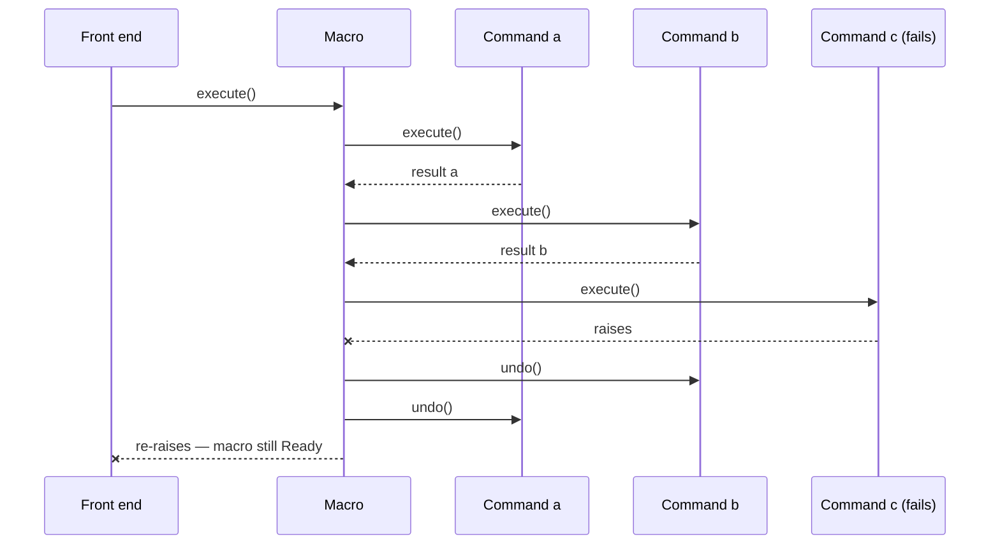
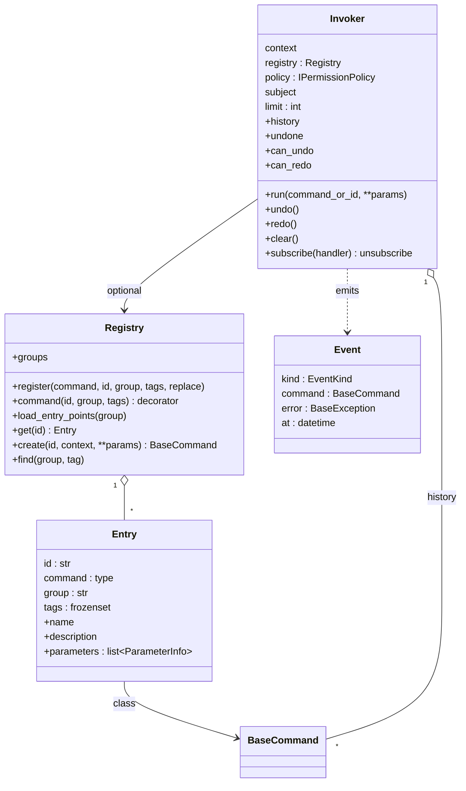
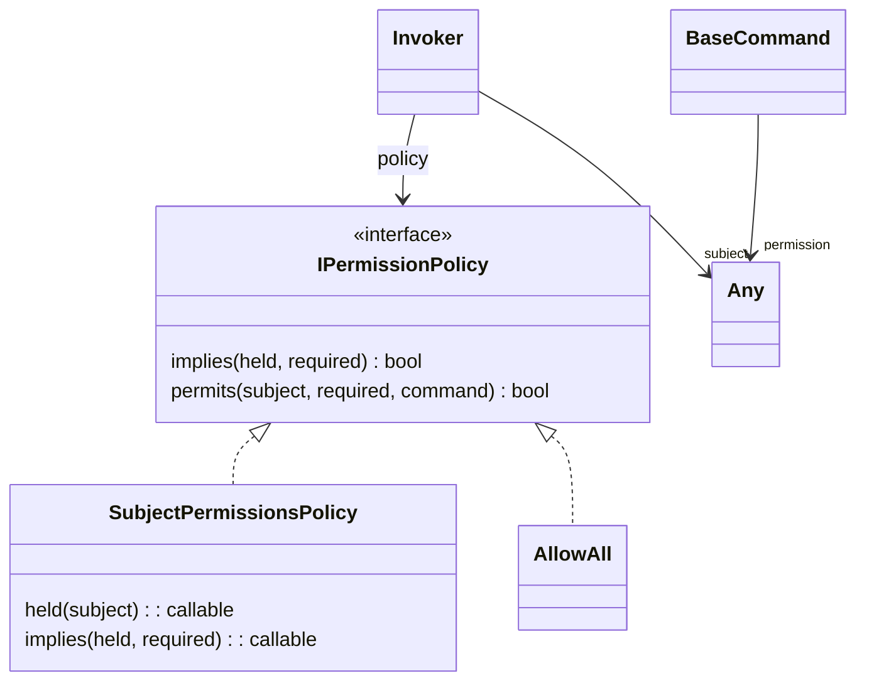
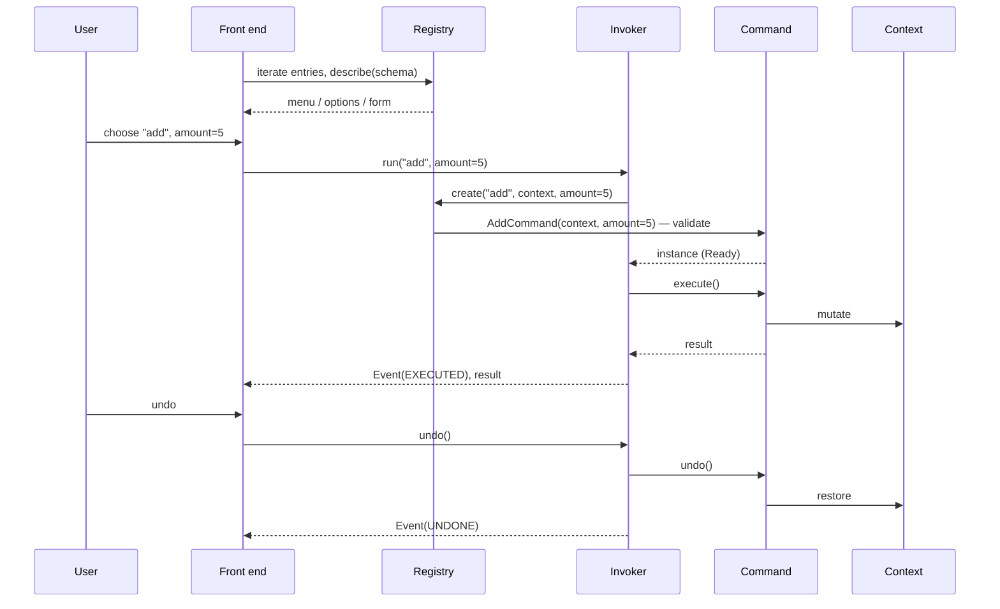
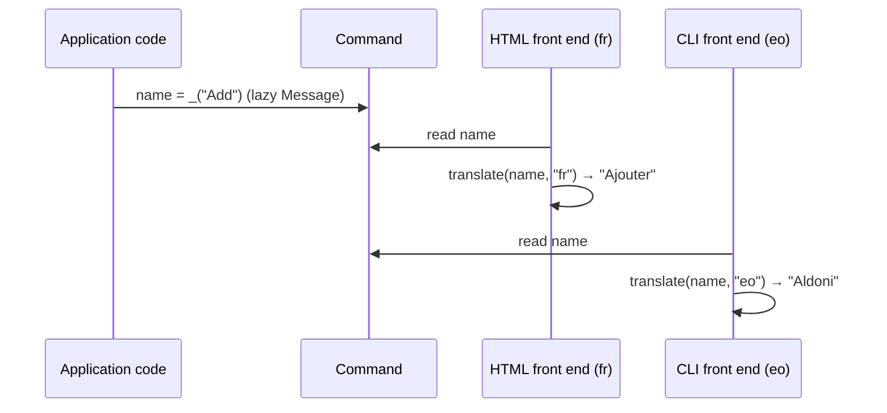

# Komandaro — Architecture

*Version française : [`docs/fr/architecture.md`](../fr/architecture.md)*

This document is the design reference. If you are new to Komandaro, start
with [How it works](how-it-works.md) (the ideas in plain words) and the
[tutorial](tutorial.md) (the same ideas as running code); the
[API reference](api.md) lists every public name.

## 1. Purpose

Komandaro exists to answer one question: **how do you write an application
once and offer it through a command line, an HTML interface, a terminal UI
or an API, without duplicating its logic?**

The answer is the *Command* design pattern (Gamma et al., 1994). Every user
action is an object that:

* knows its **name** and **description** (translatable),
* is bound to an **execution context** (the application state),
* can be **executed once**, **undone** and **redone**,
* can be **composed** into atomic macros.

A front end — CLI, HTML, TUI, JSON, an AI agent — is then nothing more than
a way to *choose* a command, *bind* it to a context, *execute* it and
*render* its result. The logic lives in the commands and nowhere else.



Front ends *read* the registry to build themselves (a sub-command per
entry, a form per schema) and *drive* the invoker to run what the user
chose. Phases 1 and 2 deliver the core; the front ends are phase 3 (§6).

## 2. Package layout

```
src/komandaro/
├── __init__.py      public API and __version__
├── interfaces.py    zope.interface contracts (kinds and states)
├── command.py       BaseCommand, SimpleCommand(Factory), Macro, CommandStateError
├── schema.py        parameter schemas: validate, describe, ParameterError
├── registry.py      Registry, Entry, RegistryError
├── invoker.py       Invoker, Event, EventKind, HistoryError
├── permissions.py   SubjectPermissionsPolicy, AllowAll, PermissionDeniedError
├── i18n.py          Message, make_gettext, bind_domain, translate
└── locale/          komandaro.pot + <lang>/LC_MESSAGES/komandaro.po
tests/               `python -m pytest`; every ```pycon block in README.md and docs/ runs too
examples/notebook/   the tutorial application: logic (notebook.py), generated CLI (cli.py), fr catalogue
docs/en, docs/fr     tutorial, how-it-works, examples, api, architecture (this document)
.github/workflows/   CI: ruff, mypy, i18n check, pytest 3.12/3.13, build
```

## 3. Interfaces: kinds and states

Two orthogonal families of `zope.interface` interfaces describe a command.

**Kinds** say what a command *is*. They are declared once on the class with
`@implementer` and never change:

| Kind | Meaning |
|---|---|
| `ISimpleCommand` | a *do* function and its inverse *undo* function |
| `IMacro` | a composite of sub-commands |

**States** say where a command *is* in its life cycle. They are provided
*directly* on the instance and swapped at each transition with
`directlyProvides`:

| State | Meaning | Allowed call |
|---|---|---|
| `ICommand` | ready | `execute()` |
| `IExecutedCommand` | executed, reversible | `undo()` |
| `IUndoneCommand` | undone, replayable | `redo()` |



Why separate kinds and states? `zope.interface` refuses to remove an
interface declared by the class (`noLongerProvides` raises `ValueError`).
The 2014 prototype tried exactly that. By keeping kinds on the class and
states on the instance, `directlyProvides(self, <state>)` replaces the
whole set of *directly provided* interfaces without touching the kind, so
`ISimpleCommand.providedBy(cmd)` stays true for the object's whole life
while `ICommand.providedBy(cmd)` reflects its current state.

## 4. Life cycle



A command instance runs **exactly once**. To repeat an operation, create a
new instance: `Add(context).execute()`. This makes each instance a
faithful record of one action — the material a history/invoker will work
on (§6).

`BaseCommand` implements the state machine once; subclasses only provide
`_do()`, `_undo()` and optionally `_redo()` (defaults to `_do()`).

### SimpleCommand and SimpleCommandFactory

`SimpleCommandFactory(do, undo, name, description)` builds a *class* whose
`do_it` and `undo_it` are **static methods** — the 2014 prototype stored
plain functions as class attributes, which Python turned into bound
methods, breaking the call. The class is what a registry will expose;
instances are per execution.

`do(context, **params)` receives the validated parameters (§5).
`undo(context, state, **params)` receives, as *state*, the value returned
by `do` — or, when the factory was given a `snapshot(context, **params)`
function, the **memento** that function captured just before execution.
This signature is a settled decision (0.3): the beginner's
`undo(context, result)` stays intact and the memento is opt-in; an explicit
`Outcome(result, memento)` object was considered and rejected as a tax on
every simple command.
`BaseCommand._snapshot()` is the general hook; its value is kept in
`command.memento` and taken once, on the first execution, so that `redo()`
restores the same starting point.

### Macro

A `Macro` holds child *instances* (usually bound to the same context). It
executes them in order and undoes them in reverse order. It is
**atomic**: if a child raises during `execute()` or `redo()`, the children
already run are undone in reverse order and the exception propagates; the
macro itself stays in its previous state.



Macros nest: a macro is a `BaseCommand` like any other.

## 5. Describing commands: parameter schemas

The 2014 prototype made commands read whatever they needed from the
context (`context.left_operand`). Nothing told a front end what to ask the
user. Komandaro separates the two:

* the **context** is the application state the command acts on;
* the **parameters** are the user's input for this execution, declared
  by a **schema** — an interface whose attributes are `zope.schema`
  fields (`Int`, `TextLine`, `Choice`, …) with a translatable title,
  a description, `required` and a `default`.

```python
class IAddParameters(Interface):
    amount = Int(title=_("Amount"), description=_("Value to add"), min=1)


Add = SimpleCommandFactory(add, undo_add, _("Add"), schema=IAddParameters, id="add")
cmd = Add(context, amount=5)  # validated here
```

`schema.validate(schema, params)` runs at instantiation: unknown names,
missing required values and invalid values are all collected and raised
together in a `ParameterError` whose `issues` carry translatable messages —
a form can show every problem at once. Defaults fill missing optional
parameters. With `schema=None` any parameters are accepted (the phase-1
behaviour).

`schema.describe(schema)` returns ordered `ParameterInfo` records (name,
field type, title, description, required, default, choices). This is the
single source every front end derives from:

| Front end | derives from `ParameterInfo` |
|---|---|
| CLI | `--amount 5`, type conversion, `--help` text |
| HTML | `<input type="number" min="1">`, label, validation messages |
| JSON / MCP | JSON schema of the tool's input |

## 6. Registry and invoker



The **registry** maps stable ids to command *classes*, in registration
order, with an optional group and tags. It is populated by `register()`,
by the `@registry.command()` decorator, or from `importlib.metadata`
entry points so that other packages can contribute commands. `Entry`
exposes what a front end needs to render a menu: id, translatable name
and description, and the described parameters.

The **invoker** is what front ends drive. `run(id, **params)` creates the
command through the registry (or takes an instance), executes it, pushes
it on the undo stack and clears the redo stack; `undo()`/`redo()` move
commands between the two stacks. Every transition — and every failure —
emits an `Event` to the subscribed handlers: a UI refreshes, an audit log
records, a persistence layer stores. A failed execution is not recorded; a
failed undo leaves the command in the history so nothing is silently lost.

### Permissions: a detachable model

A command declares the permission it requires (`permission`, any object,
`None` for public). The invoker, when given a **policy** and a
**subject**, asks `policy.permits(subject, required, command)` before
running and raises `PermissionDeniedError` (event `denied`) on refusal;
`registry.allowed(policy, subject)` gives a front end the entries it may
show. Undo and redo are not re-checked: one may always revert one's own
actions.



The core never interprets a permission. `SubjectPermissionsPolicy`, the
default, is built from two replaceable functions: `held(subject)` (what
the subject holds — its `permissions` attribute, or the subject itself)
and `implies(held, required)`, which understands three models at once:
flat names (equality), `IntFlag` bit sets (`held & required == required`,
the current AlirPunkto model) and classes (`issubclass`, so a permission
graph with multiple inheritance works out of the box, which is where
AlirPunkto is heading). Swapping the model is replacing these functions
or the whole `IPermissionPolicy`; commands and front ends do not change.



## 7. Internationalisation

Komandaro is meant to serve several users with different languages from
one process (a web server), so it **never keeps a global "current
language"**. Instead:

* `Message` is a `str` subclass carrying a gettext *domain*. `_("Add")`
  creates one. It prints, compares and hashes as the message id, so it can
  be used anywhere a string is expected.
* `translate(message, language, localedir=None)` looks the message up in
  the catalogue of its domain, for the given language (or preference list),
  and falls back to the message id if nothing is found. Front ends call it
  at *render* time with the locale of *their* user.
* `Message.localize(language, **params)` translates then `%`-formats.
* `CommandStateError` carries a `Message` and parameters; `str(error)` is
  the untranslated text, `error.translate(language)` the localised one.



**Identifiers.** Message ids are `snake_case` identifiers
(`nothing_to_undo`, `command_already_executed`), never English sentences:
English is a catalogue like the others (`en`), placeholders are written
`${name}` (`string.Template`), and `translate()` tries the requested
language, then English, then returns the identifier. This is the
convention of AlirPunkto; it lets wording be corrected without a code
change and keeps identifiers greppable in logs. `str(error)` renders in
the process language for the same reason.

**Domains.** The library's own messages are in domain `komandaro`
(catalogues `en`, `fr`, `eo`, compiled into `komandaro/locale`). An
application creates its own marker with
`_ = make_gettext("myapp", localedir)`, which binds the domain to its
catalogue directory (`bind_domain`); `translate()` then picks the right
catalogue from the message's domain, whatever the caller. Validation
errors of `zope.schema` fields are mapped to identifiers
(`field_too_short`…) and translated like the rest.

**Workflow.** `babel.cfg` configures extraction. `.po` files are versioned,
`.mo` files are built (`pybabel compile`) and git-ignored. The CI checks
that `komandaro.pot` matches the sources and that every catalogue compiles.

## 8. Roadmap

Phase 1 (0.1) delivered a sound, tested core; phase 2 (0.2) the
description layer. The following phases build the front ends on top.

```mermaid
gantt
    title Komandaro roadmap
    dateFormat  YYYY-MM
    axisFormat  %Y-%m
    section Phase 1 — core
    State machine, macros, i18n, tests, CI     :done, p1, 2026-09, 4w
    section Phase 2 — describe commands
    Parameter schema (zope.schema)             :done, p2a, after p1, 1w
    Memento hook (snapshot before execute)     :done, p2b, after p1, 1w
    Invoker: history, undo/redo stack, events  :done, p2c, after p2a, 1w
    Command registry (entry points / groups)   :done, p2d, after p2c, 1w
    Consolidation: interfaces, ids, permissions :done, p2e, after p2d, 1w
    section Phase 3 — front ends
    CLI generated from schema (argparse/Typer) :p3a, after p2d, 8w
    HTML forms + Pyramid views                 :p3b, after p2d, 12w
    TUI (Textual)                              :p3c, after p3a, 4w
    JSON API and MCP server for AI agents      :p3d, after p3b, 8w
    section Phase 4 — operations
    Async commands, persistence, audit log     :p4, after p3d, 12w
```

### Phase 2 — describing commands (0.2), consolidated (0.3)

Parameter schemas (§5), memento hook (§4), registry and invoker (§6). The
0.3 consolidation closed what the original audit had left open: the
interfaces now match the implementation and are verified by tests, the
undo signature is settled, messages are identifiers with translated field
errors, and permissions exist as a detachable model (§6). The optional
`zope.component` integration (commands as named adapters of `IContext`)
stays a candidate for a later phase; `IContext` is kept as an optional
marker for it.

### Phase 3 — front ends

Each front end is a small adapter from the registry + schema to a UI
technology: `argparse`/Typer for the CLI, form rendering plus Pyramid
views for HTML, Textual for the TUI, and a JSON API that doubles as an
**MCP server** so that the same commands become tools for AI agents.

### Phase 4 — operations

Asynchronous commands (`async def _do`), persistence of the history
(ZODB or JSON), audit logging and replay.

## 9. Design decisions

| Decision | Rationale |
|---|---|
| Keep `zope.interface` | Verifiable contracts (`verifyObject`), adapters for free, natural bridge to `zope.schema` and Pyramid; the author's ecosystem. `zope.component` is *not* required. |
| `zope.schema` for parameters | Typed fields with i18n titles, validation and vocabularies already exist and are what Pyramid/Plone form libraries consume; no need to reinvent a form model. |
| Parameters ≠ context | The context is the application state; the parameters are one execution's input. Separating them is what lets a front end ask the user for exactly what the command needs. |
| Invoker emits events instead of calling the UI | The core must not know its front ends; observers keep the dependency pointing inwards. |
| `undo(context, state, **params)` kept over an `Outcome` object | Simple commands keep the simplest signature; the memento is opt-in through `snapshot`. Decided in 0.3. |
| Message identifiers, English in the `en` catalogue | Same convention as AlirPunkto: wording lives in catalogues, code carries stable ids; `${name}` placeholders match Pyramid's `TranslationString`. |
| Permissions opaque to the core, policy replaceable | Today's `IntFlag` model and tomorrow's permission-class graph must both fit without touching commands or front ends; the policy is the only place that interprets a permission. |
| `IContext` kept as an optional marker | Costs nothing, and keeps the 2014 idea of commands as adapters of the context available for an optional `zope.component` integration. |
| States as marker interfaces, not an enum | Front ends can query `IExecutedCommand.providedBy(cmd)` and register adapters/views per state. An `is_*` property triad is provided for convenience. |
| One instance per execution | Each instance is an immutable record of one action, which is what an undo history needs. |
| Lazy messages, no global language | One process may serve many users; the locale belongs to the front end, not to the core. |
| Python ≥ 3.12, `src/` layout, hatchling | Modern packaging, no namespace package, tests run against the installed package. |
| AGPL-3.0-or-later | Copyleft that also covers network use, consistent with the author's other projects. |

## 10. History

Komandaro descends from `ecreall.command` (2014), a prototype written for
the Plone/Zope ecosystem at Ecréall. The prototype defined the interfaces
and a factory but never ran: it contained a `NameError` in the class body,
bound its do/undo functions as methods, returned an undefined variable and
tried to remove a class-level interface. Phase 1 corrected all of this,
ported the code to Python 3.12 and `@implementer`, separated kinds from
states, implemented the macro, added gettext, tests and CI.
