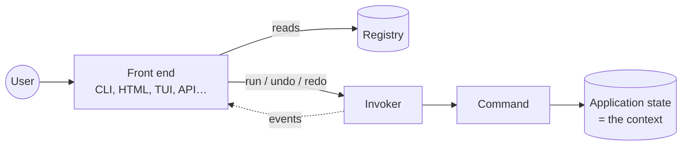
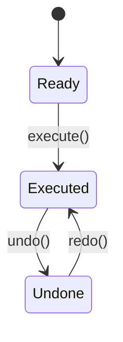

# How Komandaro works

*Version française : [`docs/fr/how-it-works.md`](../fr/how-it-works.md)*

This page explains the ideas, one at a time, in plain words. The
[tutorial](tutorial.md) shows the same things as running code; the
[architecture](architecture.md) document goes into the design.

## The one idea

Most applications tangle *what they do* with *how the user asks for it*: a
function reads `sys.argv`, another reads an HTML form, a third parses
JSON, and the actual work is copied three times or hidden behind
special cases.

Komandaro asks you to write the work **once**, as a **command**: an
object that knows its name, what it needs from the user, how to do its
job and how to undo it. Everything else — terminal, web page, API,
AI agent — is a **front end** that:

1. lists the commands and asks the user for their parameters,
2. hands the command to an **invoker** that runs it,
3. shows the result, and offers *undo*.



The front end knows nothing about notes, invoices or mazes; the commands
know nothing about terminals or browsers. That is the whole point.

## The pieces

### Context

The **context** is the object your commands act on: the application
state. Komandaro never looks inside it. A dataclass, a dictionary, a
database session, a Plone site — anything. Front ends create it; commands
receive it.

### Command

A **command** is a class. You create an *instance* for each execution,
giving it the context and the parameters:

```python
cmd = Add(notebook, text="Buy milk")
cmd.execute()  # → result
cmd.undo()
cmd.redo()
```

An instance runs **once**. Want to add two notes? Create two instances.
Each one is a permanent record of one action — the material an undo
history is made of.

Two ways to write a command:

* `SimpleCommandFactory(do, undo, name, ...)` — from two plain functions.
  Most commands are like this.
* a subclass of `BaseCommand` implementing `_do()` and `_undo()` — when you
  need methods, inheritance or a custom `_redo()`.

### The three states

An instance is always in exactly one state, and each state allows one
call:



Calling anything else raises `CommandStateError`, a translatable error.
The state is visible two ways: the properties `is_ready`, `is_executed`,
`is_undone`, or — for code in the Zope tradition — the marker interfaces
`ICommand`, `IExecutedCommand`, `IUndoneCommand` that the instance
*provides* in that state (`IExecutedCommand.providedBy(cmd)`).

### Parameters and the schema

The context is *what the application is*; the **parameters** are *what the
user asked for this time*. A command declares them with a **schema**: an
interface whose attributes are `zope.schema` fields.

```python
class IText(Interface):
    text = TextLine(title=_("Text"), min_length=1)
```

Two things happen from that single declaration:

* **validation** — `Add(nb, text="")` raises `ParameterError` *before*
  anything runs, listing every problem (unknown, missing, invalid);
* **description** — `describe(schema)` returns, for each parameter, its
  name, type, translatable title, whether it is required, its default and
  its choices. A CLI turns that into `--text`; an HTML front end into an
  `<input>`; an API into a JSON schema.

No schema (`schema=None`) means "accept anything", which is fine for
scripts and prototypes.

### Undo: result or memento?

`undo` must put the context back as it was. Two cases:

* The **result** of `do` is enough. Adding a note returns its position;
  undo deletes that position. This is the default: `undo(context, result,
  **params)`.
* You need something captured **before** `do` ran. Renaming a note
  overwrites the old text, so the old text must be saved first. Give the
  factory a `snapshot(context, **params)` function — or implement
  `_snapshot()` in your class. The value is stored as the **memento**
  (`cmd.memento`) and handed to `undo` in place of the result.

The snapshot is taken once, at the first `execute()`, so `redo()` restores
the very same starting point.

### Macro: several commands, one action

A `Macro` holds child commands. `execute()` runs them in order; `undo()`
undoes them in reverse. If a child fails half-way, the macro undoes the
children that already ran and re-raises the error: the context is never
left half-changed. A macro is itself a command, so it appears as **one**
entry in the history and macros can nest.

### Registry: the menu

A `Registry` maps stable ids (`"add"`, `"mv"`) to command classes,
optionally grouped and tagged. Front ends iterate over it to build their
menus, sub-commands or routes. Commands can be registered by hand, with a
decorator, or discovered from other packages through entry points.

### Invoker: the hands and the memory

The `Invoker` is bound to one context and, optionally, a registry. It:

* runs a command (`run("add", text=...)` or `run(instance)`),
* keeps two stacks — undo and redo — and moves commands between them,
* emits an `Event` (`executed`, `undone`, `redone`, `failed`, `cleared`)
  to every subscribed handler.

Events are how the core talks to the outside without knowing it: a UI
enables its *undo* button, an audit log writes a line, a persistence layer
saves the history.

### Permissions, without a permission model

A command may declare the permission it requires (`permission = ...`),
and an invoker may be given a **policy** and a **subject** (the user, the
session, the request — anything). Before running a command, the invoker
asks the policy `permits(subject, required, command)`; a refusal raises
`PermissionDeniedError` and emits a `denied` event. `registry.allowed(policy,
subject)` lists what the subject may run, which is how a front end builds
its menu.

What a permission *is* stays outside the core: the default policy
understands flat names, `IntFlag` bit sets (the model of AlirPunkto) and
hierarchies of permission classes, where holding a subclass grants its
bases — diamond inheritance included. Both ingredients of the policy,
"what does the subject hold" and "what implies what", are functions you can
replace, and the whole policy is an `IPermissionPolicy` you can swap.
Authentication — who the subject is — is the front end's job.

### Translation without a global language

Every user-facing string is wrapped in `_()`, which returns a **lazy
message**: a `str` that remembers it is a gettext message id and which
*domain* (catalogue) it belongs to. Nothing is translated until someone
calls `translate(message, language)`.

Why lazy? Because one process may serve many users. A web server handling
a French request and an Esperanto request at the same time cannot have "a
current language". The **front end** knows its user's locale and
translates at render time. Names, descriptions, field titles and every
error message (`error.translate("fr")`) work this way; `str(error)` uses
the language of the process (`LANGUAGE`, `LANG`…) so that logs read well.

Messages are **identifiers**, not English sentences — `_("nothing_to_undo")`,
`_("add_note")` — with the English text in the `en` catalogue like any
other language, and `${name}` placeholders. When the requested language
has no entry, English is used; failing that, the identifier itself. This
is the convention of the AlirPunkto application, and the reason a wording
can be fixed without a code change.

The library's messages are in the `komandaro` domain; your application
creates its own with `make_gettext("myapp", localedir)` and ships its own
catalogues. Validation errors raised by `zope.schema` fields are mapped to
identifiers too (`field_too_short`, `field_too_small`…), so a form can show
them in the user's language.

## Putting it together

A front end, in five lines of pseudo-code:

```text
for entry in registry:            # build the menu from the registry
    show(translate(entry.name, user.lang), describe(entry.command.schema))
params = ask_user(...)            # CLI options, HTML form, JSON body…
try:
    invoker.run(entry.id, **params)
except ParameterError as e:
    show(e.translate(user.lang))  # every problem, in the user's language
```

`examples/notebook/cli.py` is this loop written for a terminal.

## What Komandaro does not do (yet)

* **Front ends.** Phase 3 provides reusable CLI, HTML, TUI and JSON/MCP
  adapters. Today you write the loop above yourself (it is short).
* **Authentication.** Komandaro checks permissions but does not know who
  the user is: the front end provides the subject.
* **Persistence.** The history lives in memory; events give you what you
  need to store it.
* **Concurrency.** An invoker is not thread-safe; use one per session.
* **Async.** `_do()` is synchronous. Async commands are on the roadmap.

## Frequently asked questions

**Why one instance per execution rather than `execute(params)` on a
shared object?**
Because the history must remember *what* was done with *which*
parameters and *what* was captured before. An instance holds all of that
naturally; a shared object would have to reinvent it.

**Do I have to use `zope.interface` and `zope.schema`?**
They are dependencies, but they stay out of your way: `SimpleCommandFactory`
and `BaseCommand` need no Zope knowledge, and `schema=None` skips
validation entirely. Schemas are worth learning, though — they are the
part front ends are generated from.

**Can `undo` fail?**
Yes, and the invoker keeps the command in the history when it does, so
the situation is visible instead of silently lost. Write `undo` to be as
safe as possible; use a memento when the result is not enough.

**Is the redo always a re-execution?**
By default `_redo()` calls `_do()` again with the same parameters and the
memento taken the first time. Override `_redo()` if replaying should
differ from the first run.

**How do I plug in my own permission model?**
Declare permissions on your commands (any object), then give the invoker
a `SubjectPermissionsPolicy(held=..., implies=...)` with your two
functions — or any object implementing `IPermissionPolicy`. Nothing else
in Komandaro depends on what a permission is.

**How do I reuse a command in another application?**
Register it from an entry point: the other application's registry loads
it with `load_entry_points("theirapp.commands")`.
