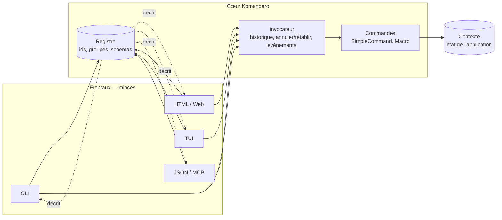
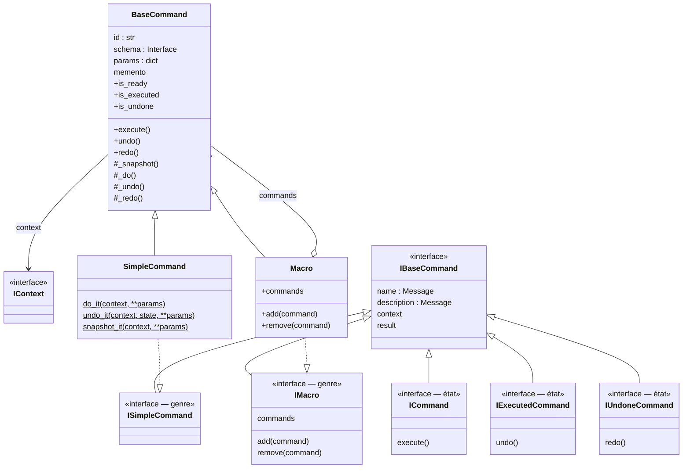
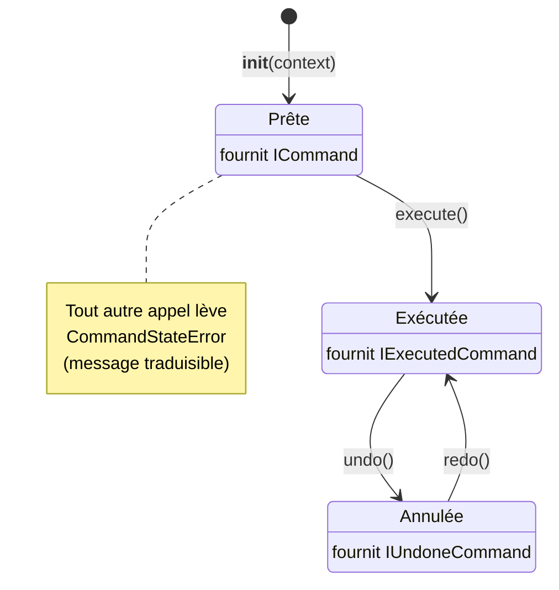
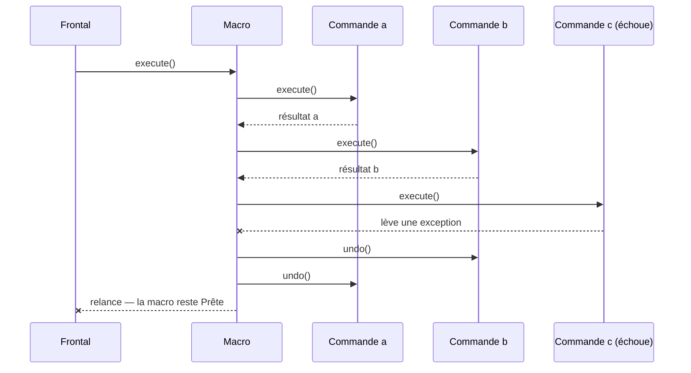
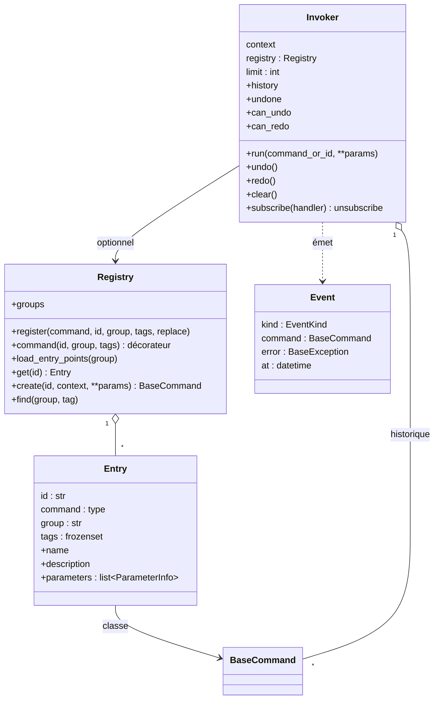
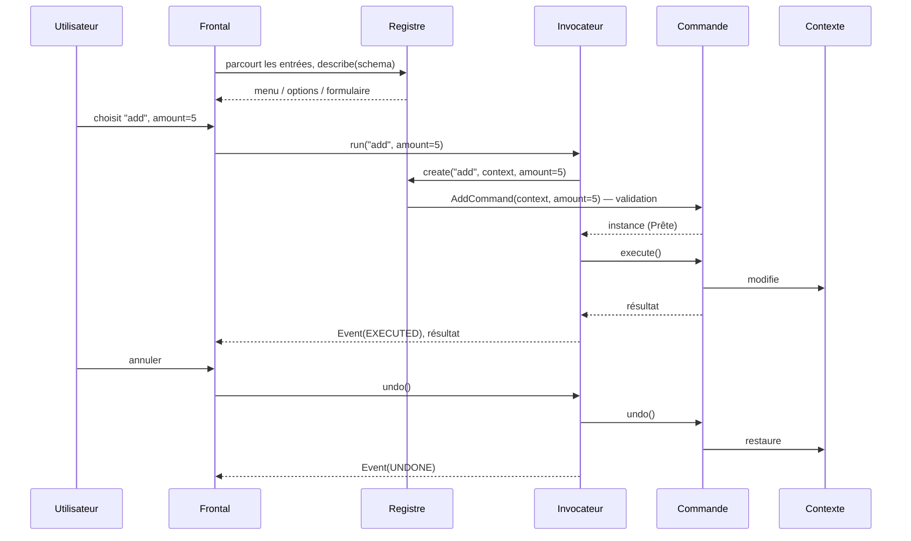
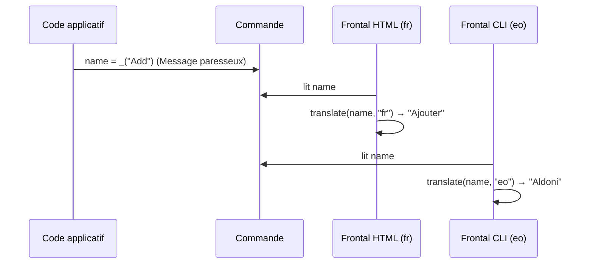
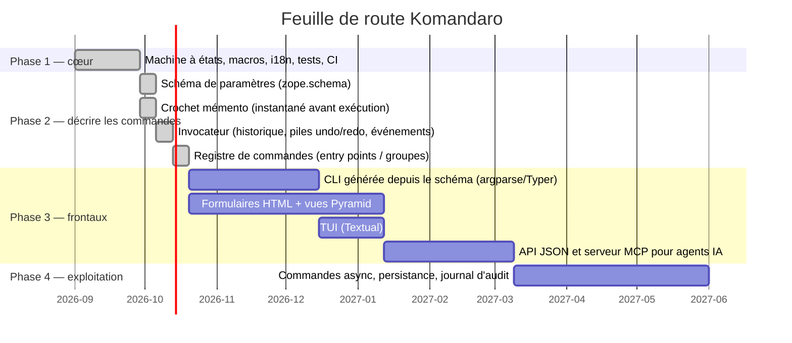

# Komandaro — Architecture

*English version: [`docs/en/architecture.md`](../en/architecture.md)*

Ce document est la référence de conception. Si vous découvrez Komandaro,
commencez par [Comment ça marche](how-it-works.md) (les idées en mots
simples) et le [tutoriel](tutorial.md) (les mêmes idées en code qui
s'exécute) ; la [référence de l'API](api.md) liste chaque nom public.

## 1. Finalité

Komandaro répond à une seule question : **comment écrire une application
une fois et l'offrir en ligne de commande, en interface HTML, en interface
terminal ou en API, sans dupliquer sa logique ?**

La réponse est le patron de conception *Commande* (Gamma et al., 1994).
Chaque action de l'utilisateur est un objet qui :

* connaît son **nom** et sa **description** (traduisibles),
* est lié à un **contexte d'exécution** (l'état de l'application),
* peut être **exécuté une fois**, **annulé** et **rétabli**,
* peut être **composé** en macros atomiques.

Un frontal — CLI, HTML, TUI, JSON, agent IA — n'est alors rien de plus
qu'une façon de *choisir* une commande, de la *lier* à un contexte, de
l'*exécuter* et de *présenter* son résultat. La logique vit dans les
commandes et nulle part ailleurs.



Les frontaux *lisent* le registre pour se construire (une sous-commande par
entrée, un formulaire par schéma) et *pilotent* l'invocateur pour exécuter
ce que l'utilisateur a choisi. Les phases 1 et 2 livrent le cœur ; les
frontaux sont la phase 3 (§8).

## 2. Organisation du paquet

```
src/komandaro/
├── __init__.py      API publique et __version__
├── interfaces.py    contrats zope.interface (genres et états)
├── command.py       BaseCommand, SimpleCommand(Factory), Macro, CommandStateError
├── schema.py        schémas de paramètres : validate, describe, ParameterError
├── registry.py      Registry, Entry, RegistryError
├── invoker.py       Invoker, Event, EventKind, HistoryError
├── i18n.py          Message, make_gettext, translate
└── locale/          komandaro.pot + <lang>/LC_MESSAGES/komandaro.po
tests/               `python -m pytest` ; chaque bloc ```pycon de README.md et docs/ s'exécute aussi
examples/notebook/   l'application du tutoriel : logique (notebook.py), CLI générée (cli.py), catalogue fr
docs/en, docs/fr     tutoriel, comment ça marche, exemples, api, architecture (ce document)
.github/workflows/   CI : ruff, mypy, vérification i18n, pytest 3.12/3.13, build
```

## 3. Interfaces : genres et états

Deux familles orthogonales d'interfaces `zope.interface` décrivent une
commande.

Les **genres** disent ce qu'une commande *est*. Ils sont déclarés une fois
sur la classe avec `@implementer` et ne changent jamais :

| Genre | Signification |
|---|---|
| `ISimpleCommand` | une fonction *do* et sa fonction inverse *undo* |
| `IMacro` | un composite de sous-commandes |

Les **états** disent où une commande *en est* dans son cycle de vie. Ils
sont fournis *directement* sur l'instance et remplacés à chaque transition
par `directlyProvides` :

| État | Signification | Appel autorisé |
|---|---|---|
| `ICommand` | prête | `execute()` |
| `IExecutedCommand` | exécutée, réversible | `undo()` |
| `IUndoneCommand` | annulée, rejouable | `redo()` |



Pourquoi séparer genres et états ? `zope.interface` refuse de retirer une
interface déclarée par la classe (`noLongerProvides` lève `ValueError`).
Le prototype de 2014 tentait exactement cela. En gardant les genres sur la
classe et les états sur l'instance, `directlyProvides(self, <état>)`
remplace l'ensemble des interfaces *directement fournies* sans toucher au
genre : `ISimpleCommand.providedBy(cmd)` reste vrai toute la vie de
l'objet, tandis que `ICommand.providedBy(cmd)` reflète son état courant.

## 4. Cycle de vie



Une instance de commande s'exécute **exactement une fois**. Pour répéter
une opération, on crée une nouvelle instance : `Add(context).execute()`.
Chaque instance est ainsi la trace fidèle d'une action — la matière
première d'un historique/invocateur (§6).

`BaseCommand` implémente la machine à états une fois pour toutes ; les
sous-classes ne fournissent que `_do()`, `_undo()` et éventuellement
`_redo()` (par défaut `_do()`).

### SimpleCommand et SimpleCommandFactory

`SimpleCommandFactory(do, undo, name, description)` construit une *classe*
dont `do_it` et `undo_it` sont des **méthodes statiques** — le prototype
de 2014 stockait des fonctions nues en attributs de classe, que Python
transformait en méthodes liées, cassant l'appel. La classe est ce qu'un
registre exposera ; les instances sont créées à chaque exécution.

`do(context, **params)` reçoit les paramètres validés (§5).
`undo(context, state, **params)` reçoit comme *state* la valeur retournée
par `do` — ou, si la fabrique a reçu une fonction
`snapshot(context, **params)`, le **mémento** capturé par cette fonction
juste avant l'exécution. `BaseCommand._snapshot()` est le crochet général ;
sa valeur est conservée dans `command.memento` et prise une seule fois, à
la première exécution, de sorte que `redo()` restaure le même point de
départ.

### Macro

Une `Macro` contient des *instances* de commandes (généralement liées au
même contexte). Elle les exécute dans l'ordre et les annule dans l'ordre
inverse. Elle est **atomique** : si une commande enfant lève une exception
pendant `execute()` ou `redo()`, les enfants déjà exécutés sont annulés
dans l'ordre inverse et l'exception se propage ; la macro reste dans son
état précédent.



Les macros s'imbriquent : une macro est une `BaseCommand` comme une autre.

## 5. Décrire les commandes : schémas de paramètres

Le prototype de 2014 faisait lire aux commandes ce dont elles avaient
besoin dans le contexte (`context.left_operand`). Rien n'indiquait à un
frontal quoi demander à l'utilisateur. Komandaro sépare les deux :

* le **contexte** est l'état de l'application sur lequel la commande agit ;
* les **paramètres** sont la saisie de l'utilisateur pour cette exécution,
  déclarés par un **schéma** — une interface dont les attributs sont des
  champs `zope.schema` (`Int`, `TextLine`, `Choice`, …) avec un titre
  traduisible, une description, `required` et un `default`.

```python
class IAddParameters(Interface):
    amount = Int(title=_("Amount"), description=_("Value to add"), min=1)


Add = SimpleCommandFactory(add, undo_add, _("Add"), schema=IAddParameters, id="add")
cmd = Add(context, amount=5)  # validé ici
```

`schema.validate(schema, params)` s'exécute à l'instanciation : noms
inconnus, valeurs obligatoires manquantes et valeurs invalides sont tous
collectés et levés ensemble dans une `ParameterError` dont les `issues`
portent des messages traduisibles — un formulaire peut afficher tous les
problèmes d'un coup. Les valeurs par défaut comblent les paramètres
optionnels absents. Avec `schema=None`, tout paramètre est accepté (le
comportement de la phase 1).

`schema.describe(schema)` renvoie des enregistrements `ParameterInfo`
ordonnés (nom, type de champ, titre, description, obligatoire, défaut,
choix). C'est la source unique dont chaque frontal dérive :

| Frontal | dérive de `ParameterInfo` |
|---|---|
| CLI | `--amount 5`, conversion de type, texte du `--help` |
| HTML | `<input type="number" min="1">`, libellé, messages de validation |
| JSON / MCP | schéma JSON de l'entrée de l'outil |

## 6. Registre et invocateur



Le **registre** associe des identifiants stables à des *classes* de
commandes, dans l'ordre d'enregistrement, avec un groupe et des étiquettes
optionnels. On le remplit par `register()`, par le décorateur
`@registry.command()`, ou depuis les entry points `importlib.metadata`
pour que d'autres paquets contribuent des commandes. `Entry` expose ce
qu'un frontal doit connaître pour afficher un menu : id, nom et
description traduisibles, paramètres décrits.

L'**invocateur** est ce que les frontaux pilotent. `run(id, **params)`
crée la commande via le registre (ou prend une instance), l'exécute,
l'empile sur la pile d'annulation et vide la pile de rétablissement ;
`undo()`/`redo()` déplacent les commandes entre les deux piles. Chaque
transition — et chaque échec — émet un `Event` vers les abonnés : une
interface se rafraîchit, un journal d'audit enregistre, une couche de
persistance stocke. Une exécution échouée n'est pas enregistrée ; une
annulation échouée laisse la commande dans l'historique pour que rien ne
se perde en silence.



## 7. Internationalisation

Komandaro est destiné à servir plusieurs utilisateurs de langues
différentes depuis un même processus (un serveur web) ; il **ne conserve
donc jamais de « langue courante » globale**. À la place :

* `Message` est une sous-classe de `str` portant un *domaine* gettext.
  `_("Add")` en crée un. Il s'affiche, se compare et se hache comme son
  identifiant de message, donc il s'emploie partout où une chaîne est
  attendue.
* `translate(message, language, localedir=None)` cherche le message dans le
  catalogue de son domaine, pour la langue donnée (ou une liste de
  préférences), et retombe sur l'identifiant si rien n'est trouvé. Les
  frontaux l'appellent au moment du *rendu*, avec la locale de *leur*
  utilisateur.
* `Message.localize(language, **params)` traduit puis formate avec `%`.
* `CommandStateError` transporte un `Message` et ses paramètres ;
  `str(error)` donne le texte non traduit, `error.translate(language)` le
  texte localisé.



**Domaines.** Les messages propres à la bibliothèque sont dans le domaine
`komandaro` (catalogues `en`, `fr`, `eo`, compilés dans
`komandaro/locale`). Une application crée son propre marqueur avec
`_ = make_gettext("monappli")` et livre ses propres catalogues ;
`translate()` choisit le bon catalogue d'après le domaine du message. On
passe `localedir` quand les catalogues vivent hors du paquet.

**Flux de travail.** `babel.cfg` configure l'extraction. Les fichiers `.po`
sont versionnés, les `.mo` sont construits (`pybabel compile`) et ignorés
par git. La CI vérifie que `komandaro.pot` correspond aux sources et que
chaque catalogue compile.

## 8. Feuille de route

La phase 1 (0.1) a livré un cœur sain et testé ; la phase 2 (0.2) la
couche de description. Les phases suivantes construisent les frontaux
par-dessus.



### Phase 2 — décrire les commandes (livrée en 0.2)

Schémas de paramètres (§5), crochet mémento (§4), registre et invocateur
(§6). Reste ouvert du plan initial : les **permissions** attachées aux
entrées du registre, qui viendront avec le premier frontal qui en a
besoin (HTML).

### Phase 3 — frontaux

Chaque frontal est un petit adaptateur du registre + schéma vers une
technologie d'interface : `argparse`/Typer pour la CLI, rendu de
formulaires et vues Pyramid pour le HTML, Textual pour la TUI, et une API
JSON qui sert aussi de **serveur MCP** afin que les mêmes commandes
deviennent des outils pour les agents IA.

### Phase 4 — exploitation

Commandes asynchrones (`async def _do`), persistance de l'historique (ZODB
ou JSON), journal d'audit et rejeu.

## 9. Décisions de conception

| Décision | Justification |
|---|---|
| Conserver `zope.interface` | Contrats vérifiables (`verifyObject`), adaptateurs gratuits, passerelle naturelle vers `zope.schema` et Pyramid ; l'écosystème de l'auteur. `zope.component` n'est *pas* requis. |
| `zope.schema` pour les paramètres | Champs typés avec titres i18n, validation et vocabulaires existent déjà et sont ce que consomment les bibliothèques de formulaires Pyramid/Plone ; inutile de réinventer un modèle de formulaire. |
| Paramètres ≠ contexte | Le contexte est l'état de l'application ; les paramètres sont la saisie d'une exécution. Les séparer est ce qui permet à un frontal de demander à l'utilisateur exactement ce dont la commande a besoin. |
| L'invocateur émet des événements au lieu d'appeler l'interface | Le cœur ne doit pas connaître ses frontaux ; les observateurs gardent la dépendance orientée vers l'intérieur. |
| États en interfaces marqueurs, pas en énumération | Les frontaux peuvent interroger `IExecutedCommand.providedBy(cmd)` et enregistrer adaptateurs/vues par état. Un triplet de propriétés `is_*` est fourni par commodité. |
| Une instance par exécution | Chaque instance est la trace immuable d'une action, ce dont un historique d'annulation a besoin. |
| Messages paresseux, pas de langue globale | Un processus peut servir plusieurs utilisateurs ; la locale appartient au frontal, pas au cœur. |
| Python ≥ 3.12, disposition `src/`, hatchling | Empaquetage moderne, pas de namespace package, tests exécutés contre le paquet installé. |
| AGPL-3.0-or-later | Copyleft couvrant aussi l'usage en réseau, cohérent avec les autres projets de l'auteur. |

## 10. Historique

Komandaro descend de `ecreall.command` (2014), un prototype écrit pour
l'écosystème Plone/Zope chez Ecréall. Le prototype définissait les
interfaces et une fabrique mais ne s'exécutait pas : `NameError` dans le
corps de classe, fonctions do/undo liées comme méthodes, variable non
définie retournée, tentative de retrait d'une interface de classe. La
phase 1 a corrigé tout cela, porté le code vers Python 3.12 et
`@implementer`, séparé genres et états, implémenté la macro, ajouté
gettext, les tests et la CI.
