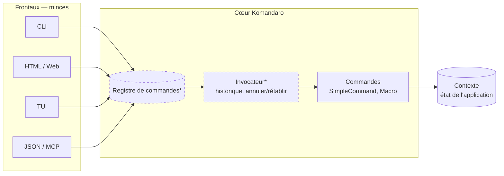
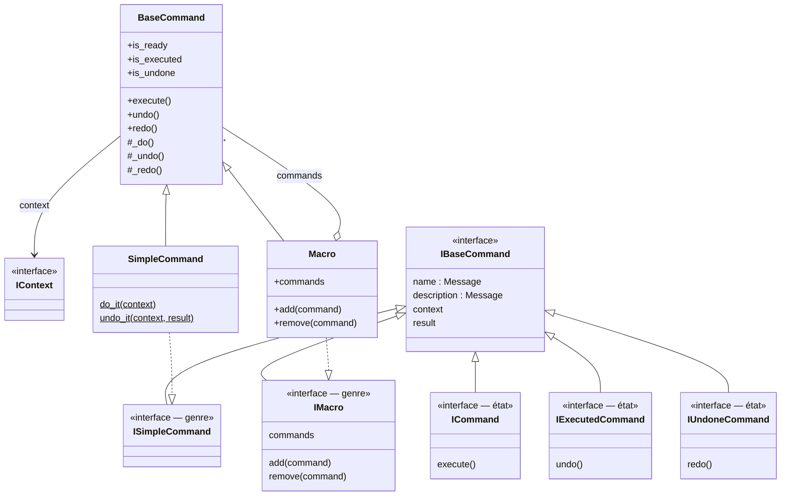
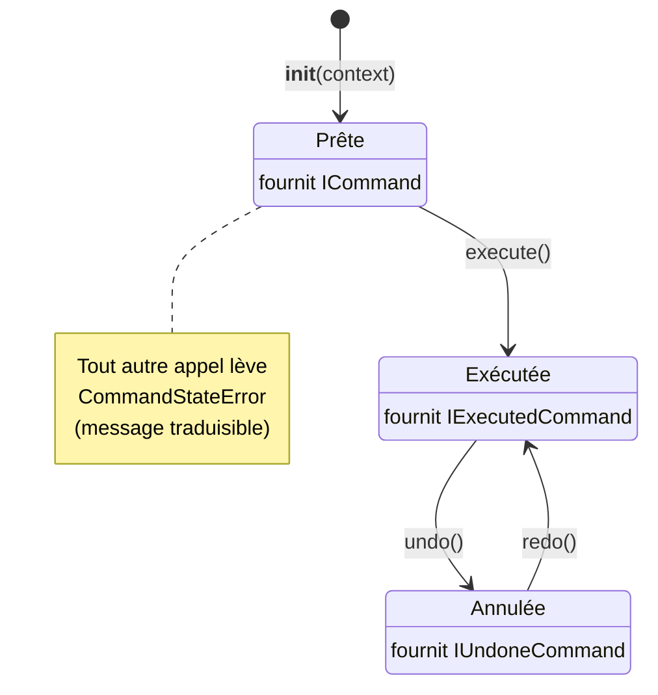
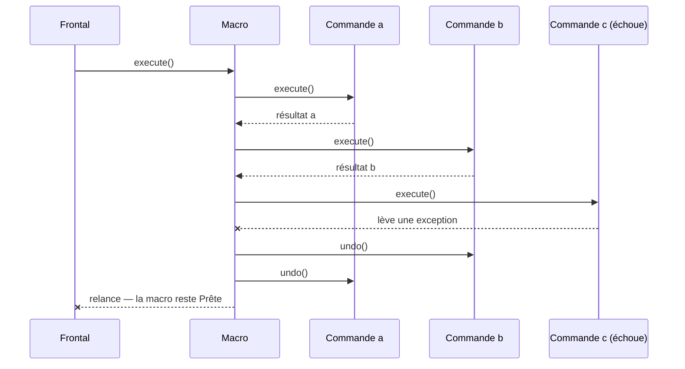
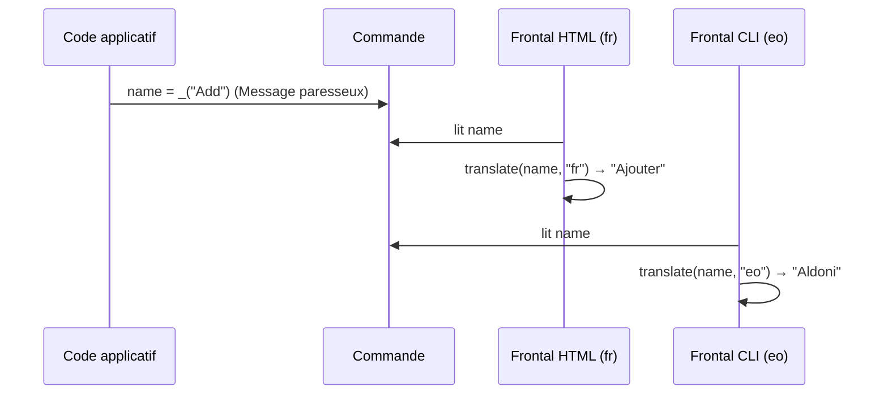
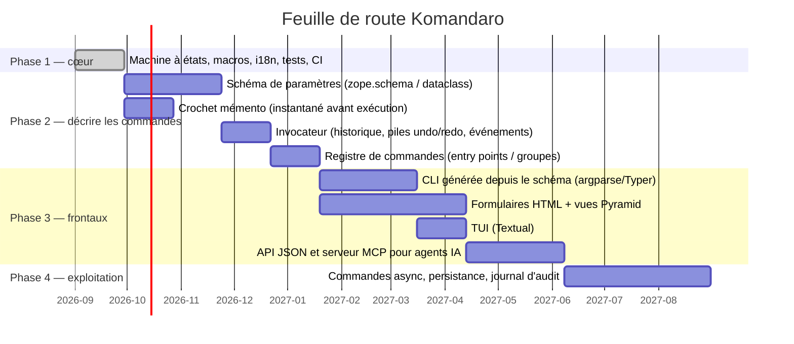

# Komandaro — Architecture

*English version: [`docs/en/architecture.md`](../en/architecture.md)*

## 1. Finalité

Komandaro répond à une seule question : **comment écrire une application
une fois et l'offrir en ligne de commande, en interface HTML, en interface
terminal ou en API, sans dupliquer sa logique ?**

La réponse est le patron de conception *Commande* (Gamma et al., 1994).
Chaque action de l'utilisateur est un objet qui :

* connaît son **nom** et sa **description** (traduisibles),
* est lié à un **contexte d'exécution** (l'état de l'application),
* peut être **exécuté une fois**, **annulé** et **rétabli**,
* peut être **composé** en macros atomiques.

Un frontal — CLI, HTML, TUI, JSON, agent IA — n'est alors rien de plus
qu'une façon de *choisir* une commande, de la *lier* à un contexte, de
l'*exécuter* et de *présenter* son résultat. La logique vit dans les
commandes et nulle part ailleurs.



Les boîtes marquées `*` sont prévues (voir §6) ; la phase 1 livre la boîte
`Commandes` et ses fondations.

## 2. Organisation du paquet

```
src/komandaro/
├── __init__.py      API publique et __version__
├── interfaces.py    contrats zope.interface (genres et états)
├── command.py       BaseCommand, SimpleCommand(Factory), Macro, CommandStateError
├── i18n.py          Message, make_gettext, translate
└── locale/          komandaro.pot + <lang>/LC_MESSAGES/komandaro.po
tests/               suite pytest (les doctests du README sont exécutés aussi)
docs/en, docs/fr     ce document
.github/workflows/   CI : ruff, mypy, vérification i18n, pytest 3.12/3.13, build
```

## 3. Interfaces : genres et états

Deux familles orthogonales d'interfaces `zope.interface` décrivent une
commande.

Les **genres** disent ce qu'une commande *est*. Ils sont déclarés une fois
sur la classe avec `@implementer` et ne changent jamais :

| Genre | Signification |
|---|---|
| `ISimpleCommand` | une fonction *do* et sa fonction inverse *undo* |
| `IMacro` | un composite de sous-commandes |

Les **états** disent où une commande *en est* dans son cycle de vie. Ils
sont fournis *directement* sur l'instance et remplacés à chaque transition
par `directlyProvides` :

| État | Signification | Appel autorisé |
|---|---|---|
| `ICommand` | prête | `execute()` |
| `IExecutedCommand` | exécutée, réversible | `undo()` |
| `IUndoneCommand` | annulée, rejouable | `redo()` |



Pourquoi séparer genres et états ? `zope.interface` refuse de retirer une
interface déclarée par la classe (`noLongerProvides` lève `ValueError`).
Le prototype de 2014 tentait exactement cela. En gardant les genres sur la
classe et les états sur l'instance, `directlyProvides(self, <état>)`
remplace l'ensemble des interfaces *directement fournies* sans toucher au
genre : `ISimpleCommand.providedBy(cmd)` reste vrai toute la vie de
l'objet, tandis que `ICommand.providedBy(cmd)` reflète son état courant.

## 4. Cycle de vie



Une instance de commande s'exécute **exactement une fois**. Pour répéter
une opération, on crée une nouvelle instance : `Add(context).execute()`.
Chaque instance est ainsi la trace fidèle d'une action — la matière
première d'un historique/invocateur (§6).

`BaseCommand` implémente la machine à états une fois pour toutes ; les
sous-classes ne fournissent que `_do()`, `_undo()` et éventuellement
`_redo()` (par défaut `_do()`).

### SimpleCommand et SimpleCommandFactory

`SimpleCommandFactory(do, undo, name, description)` construit une *classe*
dont `do_it` et `undo_it` sont des **méthodes statiques** — le prototype
de 2014 stockait des fonctions nues en attributs de classe, que Python
transformait en méthodes liées, cassant l'appel. La classe est ce qu'un
registre exposera ; les instances sont créées à chaque exécution.

`undo(context, result)` reçoit la valeur retournée par `do(context)`. Pour
des opérations simples cela suffit ; les opérations qui ont besoin d'un
instantané de l'état pris *avant* exécution recevront un crochet mémento
en phase 2.

### Macro

Une `Macro` contient des *instances* de commandes (généralement liées au
même contexte). Elle les exécute dans l'ordre et les annule dans l'ordre
inverse. Elle est **atomique** : si une commande enfant lève une exception
pendant `execute()` ou `redo()`, les enfants déjà exécutés sont annulés
dans l'ordre inverse et l'exception se propage ; la macro reste dans son
état précédent.



Les macros s'imbriquent : une macro est une `BaseCommand` comme une autre.

## 5. Internationalisation

Komandaro est destiné à servir plusieurs utilisateurs de langues
différentes depuis un même processus (un serveur web) ; il **ne conserve
donc jamais de « langue courante » globale**. À la place :

* `Message` est une sous-classe de `str` portant un *domaine* gettext.
  `_("Add")` en crée un. Il s'affiche, se compare et se hache comme son
  identifiant de message, donc il s'emploie partout où une chaîne est
  attendue.
* `translate(message, language, localedir=None)` cherche le message dans le
  catalogue de son domaine, pour la langue donnée (ou une liste de
  préférences), et retombe sur l'identifiant si rien n'est trouvé. Les
  frontaux l'appellent au moment du *rendu*, avec la locale de *leur*
  utilisateur.
* `Message.localize(language, **params)` traduit puis formate avec `%`.
* `CommandStateError` transporte un `Message` et ses paramètres ;
  `str(error)` donne le texte non traduit, `error.translate(language)` le
  texte localisé.



**Domaines.** Les messages propres à la bibliothèque sont dans le domaine
`komandaro` (catalogues `en`, `fr`, `eo`, compilés dans
`komandaro/locale`). Une application crée son propre marqueur avec
`_ = make_gettext("monappli")` et livre ses propres catalogues ;
`translate()` choisit le bon catalogue d'après le domaine du message. On
passe `localedir` quand les catalogues vivent hors du paquet.

**Flux de travail.** `babel.cfg` configure l'extraction. Les fichiers `.po`
sont versionnés, les `.mo` sont construits (`pybabel compile`) et ignorés
par git. La CI vérifie que `komandaro.pot` correspond aux sources et que
chaque catalogue compile.

## 6. Feuille de route

La phase 1 (0.1) livre un cœur sain et testé. Les phases suivantes
construisent la promesse « une logique, plusieurs interfaces » par-dessus.



### Phase 2 — décrire les commandes

* **Schéma de paramètres.** Chaque classe de commande déclare les
  paramètres qu'elle lit dans le contexte : type, libellé traduisible,
  valeur par défaut, contraintes. C'est la clé de voûte de la portabilité :
  une CLI en dérive ses options et son `--help`, un frontal HTML un
  formulaire, une API un schéma JSON. `zope.schema` est le choix naturel
  dans cet écosystème ; une alternative à base de dataclasses sera évaluée.
* **Mémento.** Un crochet optionnel `snapshot(context)` exécuté avant
  `_do()`, dont la valeur est transmise à `_undo()`, pour les opérations
  dont l'inverse ne se déduit pas du seul résultat.
* **Invocateur.** Possède les piles annuler/rétablir, exécute les
  commandes, émet des événements (exécutée, annulée, rétablie) auxquels
  frontaux et journaux d'audit s'abonnent.
* **Registre.** Découvre les classes de commandes (entry points ou
  enregistrement explicite), les organise en groupes, leur attache des
  permissions.

### Phase 3 — frontaux

Chaque frontal est un petit adaptateur du registre + schéma vers une
technologie d'interface : `argparse`/Typer pour la CLI, rendu de
formulaires et vues Pyramid pour le HTML, Textual pour la TUI, et une API
JSON qui sert aussi de **serveur MCP** afin que les mêmes commandes
deviennent des outils pour les agents IA.

### Phase 4 — exploitation

Commandes asynchrones (`async def _do`), persistance de l'historique (ZODB
ou JSON), journal d'audit et rejeu.

## 7. Décisions de conception

| Décision | Justification |
|---|---|
| Conserver `zope.interface` | Contrats vérifiables (`verifyObject`), adaptateurs gratuits, passerelle naturelle vers `zope.schema` et Pyramid ; l'écosystème de l'auteur. `zope.component` n'est *pas* requis. |
| États en interfaces marqueurs, pas en énumération | Les frontaux peuvent interroger `IExecutedCommand.providedBy(cmd)` et enregistrer adaptateurs/vues par état. Un triplet de propriétés `is_*` est fourni par commodité. |
| Une instance par exécution | Chaque instance est la trace immuable d'une action, ce dont un historique d'annulation a besoin. |
| Messages paresseux, pas de langue globale | Un processus peut servir plusieurs utilisateurs ; la locale appartient au frontal, pas au cœur. |
| Python ≥ 3.12, disposition `src/`, hatchling | Empaquetage moderne, pas de namespace package, tests exécutés contre le paquet installé. |
| AGPL-3.0-or-later | Copyleft couvrant aussi l'usage en réseau, cohérent avec les autres projets de l'auteur. |

## 8. Historique

Komandaro descend de `ecreall.command` (2014), un prototype écrit pour
l'écosystème Plone/Zope chez Ecréall. Le prototype définissait les
interfaces et une fabrique mais ne s'exécutait pas : `NameError` dans le
corps de classe, fonctions do/undo liées comme méthodes, variable non
définie retournée, tentative de retrait d'une interface de classe. La
phase 1 a corrigé tout cela, porté le code vers Python 3.12 et
`@implementer`, séparé genres et états, implémenté la macro, ajouté
gettext, les tests et la CI.
