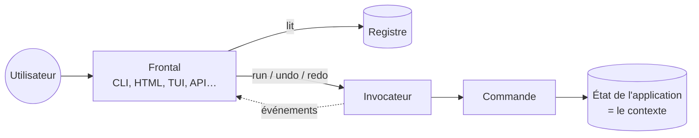
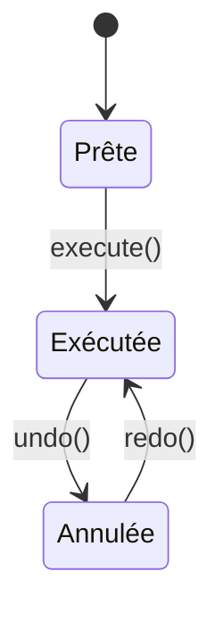

# Comment Komandaro fonctionne

*English version: [`docs/en/how-it-works.md`](../en/how-it-works.md)*

Cette page explique les idées, une par une, en mots simples. Le
[tutoriel](tutorial.md) montre les mêmes choses sous forme de code qui
s'exécute ; le document d'[architecture](architecture.md) entre dans la
conception.

## L'idée unique

La plupart des applications mélangent *ce qu'elles font* et *comment
l'utilisateur le demande* : une fonction lit `sys.argv`, une autre lit un
formulaire HTML, une troisième analyse du JSON, et le vrai travail est
recopié trois fois ou caché derrière des cas particuliers.

Komandaro vous demande d'écrire le travail **une fois**, sous forme de
**commande** : un objet qui connaît son nom, ce qu'il attend de
l'utilisateur, comment faire son travail et comment le défaire. Tout le
reste — terminal, page web, API, agent IA — est un **frontal** qui :

1. liste les commandes et demande leurs paramètres à l'utilisateur,
2. confie la commande à un **invocateur** qui l'exécute,
3. affiche le résultat, et propose *annuler*.



Le frontal ne sait rien des notes, des factures ou des labyrinthes ; les
commandes ne savent rien des terminaux ni des navigateurs. C'est tout
l'intérêt.

## Les pièces

### Le contexte

Le **contexte** est l'objet sur lequel vos commandes agissent : l'état de
l'application. Komandaro ne regarde jamais dedans. Une dataclass, un
dictionnaire, une session de base de données, un site Plone — n'importe
quoi. Les frontaux le créent ; les commandes le reçoivent.

### La commande

Une **commande** est une classe. On crée une *instance* pour chaque
exécution, en lui donnant le contexte et les paramètres :

```python
cmd = Add(notebook, text="Buy milk")
cmd.execute()  # → résultat
cmd.undo()
cmd.redo()
```

Une instance s'exécute **une fois**. Vous voulez ajouter deux notes ?
Créez deux instances. Chacune est la trace permanente d'une action — la
matière dont est fait un historique d'annulation.

Deux façons d'écrire une commande :

* `SimpleCommandFactory(do, undo, name, ...)` — à partir de deux fonctions
  ordinaires. La plupart des commandes sont ainsi.
* une sous-classe de `BaseCommand` implémentant `_do()` et `_undo()` —
  quand il vous faut des méthodes, de l'héritage ou un `_redo()`
  particulier.

### Les trois états

Une instance est toujours dans exactement un état, et chaque état
n'autorise qu'un appel :



Tout autre appel lève `CommandStateError`, une erreur traduisible. L'état
se lit de deux façons : les propriétés `is_ready`, `is_executed`,
`is_undone`, ou — pour le code de tradition Zope — les interfaces
marqueurs `ICommand`, `IExecutedCommand`, `IUndoneCommand` que l'instance
*fournit* dans cet état (`IExecutedCommand.providedBy(cmd)`).

### Paramètres et schéma

Le contexte est *ce qu'est l'application* ; les **paramètres** sont *ce
que l'utilisateur a demandé cette fois-ci*. Une commande les déclare avec
un **schéma** : une interface dont les attributs sont des champs
`zope.schema`.

```python
class IText(Interface):
    text = TextLine(title=_("Text"), min_length=1)
```

De cette seule déclaration découlent deux choses :

* la **validation** — `Add(nb, text="")` lève `ParameterError` *avant*
  toute exécution, en listant tous les problèmes (inconnu, manquant,
  invalide) ;
* la **description** — `describe(schema)` renvoie, pour chaque paramètre,
  son nom, son type, son titre traduisible, son caractère obligatoire, sa
  valeur par défaut et ses choix. Une CLI en fait `--text` ; un frontal
  HTML un `<input>` ; une API un schéma JSON.

Pas de schéma (`schema=None`) signifie « accepter n'importe quoi », ce qui
convient aux scripts et aux prototypes.

### Annuler : résultat ou mémento ?

`undo` doit remettre le contexte comme il était. Deux cas :

* Le **résultat** de `do` suffit. Ajouter une note renvoie sa position ;
  annuler supprime cette position. C'est le comportement par défaut :
  `undo(context, result, **params)`.
* Il vous faut quelque chose capturé **avant** l'exécution de `do`.
  Renommer une note écrase l'ancien texte, il faut donc le sauvegarder
  d'abord. Donnez à la fabrique une fonction `snapshot(context, **params)`
  — ou implémentez `_snapshot()` dans votre classe. La valeur est
  conservée comme **mémento** (`cmd.memento`) et transmise à `undo` à la
  place du résultat.

L'instantané est pris une seule fois, au premier `execute()`, si bien que
`redo()` restaure exactement le même point de départ.

### La macro : plusieurs commandes, une action

Une `Macro` contient des commandes enfants. `execute()` les exécute dans
l'ordre ; `undo()` les annule dans l'ordre inverse. Si un enfant échoue en
cours de route, la macro annule les enfants déjà exécutés et relance
l'erreur : le contexte n'est jamais laissé à moitié modifié. Une macro
est elle-même une commande : elle apparaît comme **une** entrée dans
l'historique, et les macros s'imbriquent.

### Le registre : le menu

Un `Registry` associe des identifiants stables (`"add"`, `"mv"`) à des
classes de commandes, avec groupes et étiquettes optionnels. Les frontaux
le parcourent pour construire leurs menus, sous-commandes ou routes. Les
commandes s'enregistrent à la main, par décorateur, ou sont découvertes
dans d'autres paquets via les entry points.

### L'invocateur : les mains et la mémoire

L'`Invoker` est lié à un contexte et, optionnellement, à un registre.
Il :

* exécute une commande (`run("add", text=...)` ou `run(instance)`),
* tient deux piles — annuler et rétablir — et déplace les commandes de
  l'une à l'autre,
* émet un `Event` (`executed`, `undone`, `redone`, `failed`, `cleared`)
  vers chaque gestionnaire abonné.

Les événements sont la façon dont le cœur parle à l'extérieur sans le
connaître : une interface active son bouton *annuler*, un journal d'audit
écrit une ligne, une couche de persistance sauvegarde l'historique.

### Les permissions, sans modèle de permission

Une commande peut déclarer la permission qu'elle exige
(`permission = ...`), et un invocateur peut recevoir une **politique** et
un **sujet** (l'utilisateur, la session, la requête — n'importe quoi).
Avant d'exécuter une commande, l'invocateur demande à la politique
`permits(subject, required, command)` ; un refus lève
`PermissionDeniedError` et émet un événement `denied`.
`registry.allowed(policy, subject)` liste ce que le sujet peut exécuter :
c'est ainsi qu'un frontal construit son menu.

Ce qu'*est* une permission reste hors du cœur : la politique par défaut
comprend les noms plats, les jeux de bits `IntFlag` (le modèle
d'AlirPunkto) et les hiérarchies de classes de permission, où détenir une
sous-classe accorde ses bases — héritage en losange compris. Les deux
ingrédients de la politique, « que détient le sujet » et « qu'est-ce qui
implique quoi », sont des fonctions remplaçables, et la politique entière
est une `IPermissionPolicy` interchangeable. L'authentification — qui est
le sujet — relève du frontal.

### La traduction sans langue globale

Chaque chaîne destinée à l'utilisateur est enveloppée dans `_()`, qui
renvoie un **message paresseux** : une `str` qui se souvient qu'elle est
un identifiant de message gettext et à quel *domaine* (catalogue) elle
appartient. Rien n'est traduit tant que personne n'appelle
`translate(message, langue)`.

Pourquoi paresseux ? Parce qu'un processus peut servir de nombreux
utilisateurs. Un serveur web traitant en même temps une requête en
français et une en espéranto ne peut pas avoir « une langue courante ».
Le **frontal** connaît la locale de son utilisateur et traduit au moment
du rendu. Noms, descriptions, titres de champs et chaque message d'erreur
(`error.translate("fr")`) fonctionnent ainsi ; `str(error)` utilise la
langue du processus (`LANGUAGE`, `LANG`…) pour que les journaux restent
lisibles.

Les messages sont des **identifiants**, pas des phrases anglaises —
`_("nothing_to_undo")`, `_("add_note")` — avec le texte anglais dans le
catalogue `en` comme pour toute autre langue, et des espaces réservés
`${name}`. Quand la langue demandée n'a pas d'entrée, l'anglais est
utilisé ; à défaut, l'identifiant lui-même. C'est la convention de
l'application AlirPunkto, et la raison pour laquelle une formulation se
corrige sans toucher au code.

Les messages de la bibliothèque sont dans le domaine `komandaro` ; votre
application crée le sien avec `make_gettext("monappli", localedir)` et
livre ses propres catalogues. Les erreurs de validation levées par les
champs `zope.schema` sont elles aussi associées à des identifiants
(`field_too_short`, `field_too_small`…), pour qu'un formulaire les affiche
dans la langue de l'utilisateur.

## Assembler le tout

Un frontal, en cinq lignes de pseudo-code :

```text
for entry in registry:            # construire le menu depuis le registre
    show(translate(entry.name, user.lang), describe(entry.command.schema))
params = ask_user(...)            # options CLI, formulaire HTML, corps JSON…
try:
    invoker.run(entry.id, **params)
except ParameterError as e:
    show(e.translate(user.lang))  # tous les problèmes, dans la langue de l'utilisateur
```

`examples/notebook/cli.py` est cette boucle écrite pour un terminal.

## Ce que Komandaro ne fait pas (encore)

* **Les frontaux.** La phase 3 fournira des adaptateurs CLI, HTML, TUI et
  JSON/MCP réutilisables. Aujourd'hui, vous écrivez vous-même la boucle
  ci-dessus (elle est courte).
* **L'authentification.** Komandaro vérifie les permissions mais ne sait
  pas qui est l'utilisateur : c'est le frontal qui fournit le sujet.
* **La persistance.** L'historique vit en mémoire ; les événements vous
  donnent ce qu'il faut pour le stocker.
* **La concurrence.** Un invocateur n'est pas thread-safe ; utilisez-en un
  par session.
* **L'asynchrone.** `_do()` est synchrone. Les commandes async sont sur la
  feuille de route.

## Questions fréquentes

**Pourquoi une instance par exécution plutôt qu'un `execute(params)` sur un
objet partagé ?**
Parce que l'historique doit se souvenir de *ce qui* a été fait avec
*quels* paramètres et de *ce qui* a été capturé avant. Une instance porte
tout cela naturellement ; un objet partagé devrait le réinventer.

**Dois-je utiliser `zope.interface` et `zope.schema` ?**
Ce sont des dépendances, mais elles restent discrètes :
`SimpleCommandFactory` et `BaseCommand` ne demandent aucune connaissance
de Zope, et `schema=None` saute entièrement la validation. Les schémas
méritent toutefois d'être appris : ce sont eux dont les frontaux sont
générés.

**`undo` peut-il échouer ?**
Oui, et l'invocateur garde alors la commande dans l'historique, de sorte
que la situation reste visible au lieu d'être perdue en silence. Écrivez
`undo` aussi sûr que possible ; utilisez un mémento quand le résultat ne
suffit pas.

**Le rétablissement est-il toujours une réexécution ?**
Par défaut `_redo()` rappelle `_do()` avec les mêmes paramètres et le
mémento pris la première fois. Redéfinissez `_redo()` si rejouer doit
différer de la première exécution.

**Comment brancher mon propre modèle de permissions ?**
Déclarez les permissions sur vos commandes (n'importe quel objet), puis
donnez à l'invocateur une `SubjectPermissionsPolicy(held=..., implies=...)`
avec vos deux fonctions — ou tout objet implémentant `IPermissionPolicy`.
Rien d'autre dans Komandaro ne dépend de ce qu'est une permission.

**Comment réutiliser une commande dans une autre application ?**
Enregistrez-la via un entry point : le registre de l'autre application la
charge avec `load_entry_points("leurappli.commands")`.
